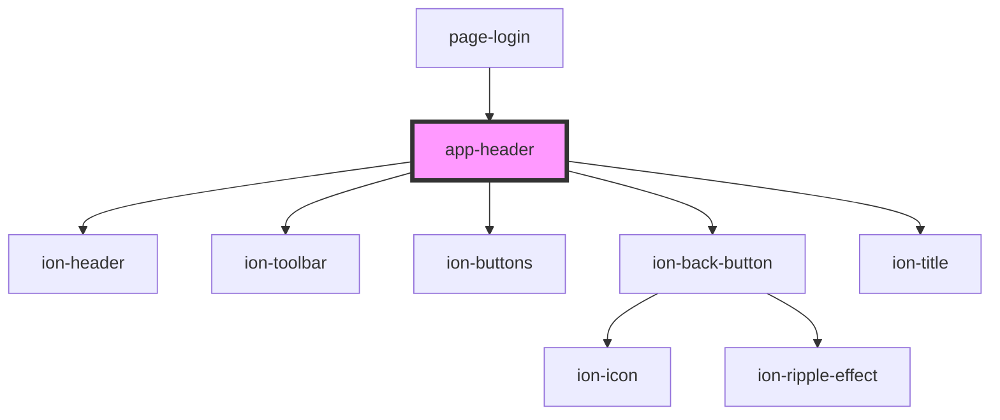

# app-header

<!-- Auto Generated Below -->

## Dependencies

### Used by

 - [page-login](../pages/page-login)

### Depends on

- ion-header
- ion-toolbar
- ion-buttons
- ion-back-button
- ion-title

### Graph

----------------------------------------------

Built by Matt, using Stencil
