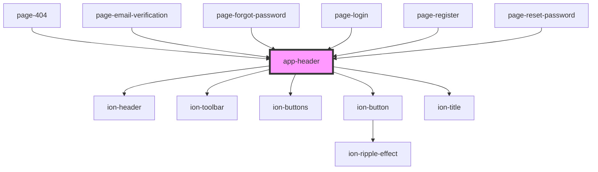

# app-header

<!-- Auto Generated Below -->

## Dependencies

### Used by

 - [page-404](../pages/page-404)
 - [page-email-verification](../pages/auth/page-email-verification)
 - [page-forgot-password](../pages/auth/page-forgot-password)
 - [page-login](../pages/auth/page-login)
 - [page-register](../pages/auth/page-register)
 - [page-reset-password](../pages/auth/page-reset-password)

### Depends on

- ion-header
- ion-toolbar
- ion-buttons
- ion-button
- ion-title

### Graph

----------------------------------------------

Built by Matt, using Stencil
