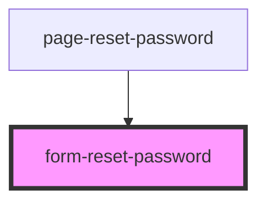

# form-reset-password

<!-- Auto Generated Below -->

## Properties

| Property             | Attribute | Description                                   | Type     | Default     |
| -------------------- | --------- | --------------------------------------------- | -------- | ----------- |
| `token` _(required)_ | `token`   | The password reset token generated by the api | `string` | `undefined` |

## Dependencies

### Used by

 - [page-reset-password](../../../pages/auth/page-reset-password)

### Graph

----------------------------------------------

Built by Matt, using Stencil
