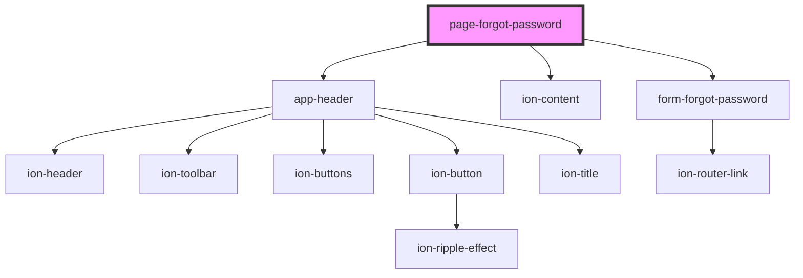

# page-forgot-password

<!-- Auto Generated Below -->

## Dependencies

### Depends on

- [app-header](../../../app-header)
- ion-content
- [form-forgot-password](../../../forms/auth/forgot-password)

### Graph

----------------------------------------------

Built by Matt, using Stencil
