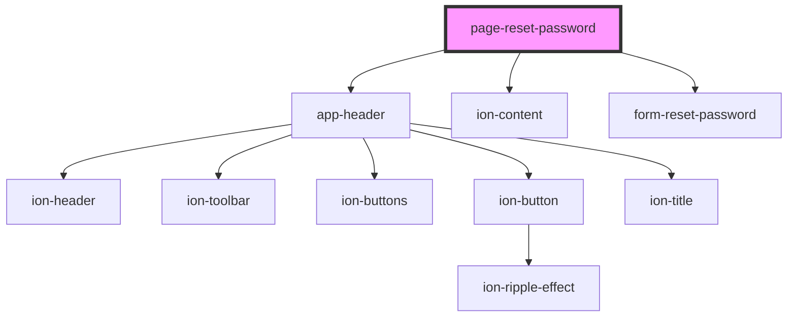

# page-reset-password

<!-- Auto Generated Below -->

## Properties

| Property | Attribute | Description | Type     | Default |
| -------- | --------- | ----------- | -------- | ------- |
| `token`  | `token`   |             | `string` | `''`    |

## Dependencies

### Depends on

- [app-header](../../../app-header)
- ion-content
- [form-reset-password](../../../forms/auth/reset-password)

### Graph

----------------------------------------------

Built by Matt, using Stencil
