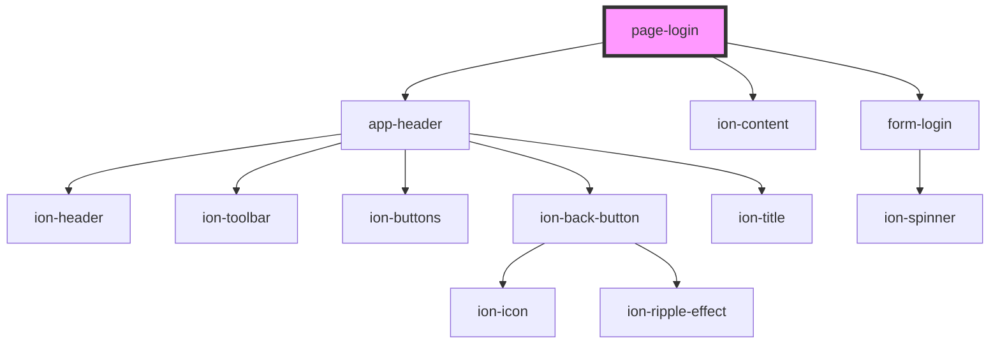

# page-login

<!-- Auto Generated Below -->

## Dependencies

### Depends on

- [app-header](../../app-header)
- ion-content
- [form-login](../../forms/auth/login)

### Graph

----------------------------------------------

Built by Matt, using Stencil
